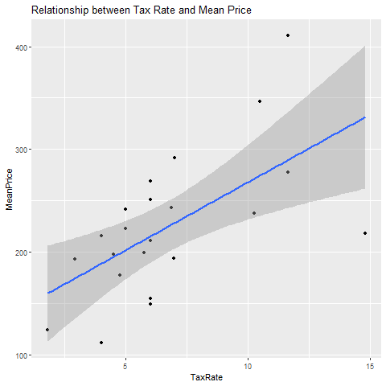

```{r setup, include=FALSE, error=F}
knitr::opts_chunk$set(echo = TRUE)
```


# Motivations

Our topic focuses on the relationship between policies across state's and the overall price of short term rentals. The motivation behind the research is to further understand the markets behind short term rentals and potentially understand inflated costs for the consumer. As Financial Engineers, we are always interested in looking at how policy effects different investment opportunities. With many previous classes teaching us the theory behind the economical principals, we wanted to demonstrate and find a real life example of the material we learned. 

# Data Construction

The data that we have gathered consists of many cities spread across a majority of states in the US and short term rental tax rates in the United States. Because we wanted to encompass as many different types of cities as possible, our data covers all available data from our data source located in the U.S. and ranges across almost all geographical regions and economical landscapes. By covering a majority of the United States area while also covering many different economical landscapes. The data is primarily tourist hubs as these locations have the densest collection of AirBnB rental properties while also covering a large span of different government policies, however the available data includes several smaller cities that help provide a complete picture of how rental markets are behaving. The data sets consist of the most recent months data for 32 different cities. In our code, we manipulate this data by first importing all of the files in iteratively via .csv files we downloaded to our public GitHub repository then importing all of the data into individual data frames with the city name as the data frame title. As we complete this process, we insert each of the data frames into a list in order to reference them iteratively later. Next, we add a location column to all of the data frames as there was no prior labeling present in the imported data. This process is completed by extracting the names of the cities out of the data frames in our created list, inserting the title of the data frame via an external file, creating a repeated vector of the city name, then appending it to the data frame within the list. This makes the final merged data usable and was a crucial step of our process. Finally, after each data frame had added a column with their location, we bound the data frames together into our "final" tidy data set using a do.call and finalized with the general cleaning process. 

After merging the data frames together, we took out the all columns we knew we would not be exploring, erring on the side of caution and leaving in more than was realistically necessary as we were still in the exploratory phase of our research.  The units in our data are primarily numerical and act as counts of values. The columns relating to money are in United States Dollars and the columns relating to rates are in percentages. Other values in our data set are primarily used for data manipulation such as a location's name. When looking for missing data, our data set was initially very clean and did not require much, if any, cleaning for the columns we were interested in exploring. Some columns did have missing or NA values, but those columns were of little importance and were previously deleted due to their irrelevance to the scope of our project. We chose not to remove any extreme data as there were not any points that were taking away from the findings of our research and all points thus far have seemed to contribute appropriately. The extreme values in our data set are important to retain as they help encapsulate the entire market of AirBnB, a company that has accumulated much ill will in the eyes of the public and policy makers alike. To remove these extreme examples takes away much of the absurdity that kindles this dissent, thus painting an incomplete picture.

# Data Exploration

After importing and cleaning our data we were able to make several interesting findings, starting with a bar plot that shows the mean prices of a short term rental in increasing order. Rochester, at just over 100 dollars per night, is the minimum value while Hawaii is the maximum value at over 500 dollars per night. Because the data only spans one month, seasonal factors must be considered for pricing and may lead to price inflation or deflation depending on the climate, events, or other tourist attractions that may sway prices. Thus, drawing conclusive causal findings is irresponsible and unlikely. This graph was primarily used to better understand our data set better and visualize the distribution of how prices vary across the country. 

<center>

{width=700px}

</center>

After looking at the preliminary chart we began to focus on the relationship between policies and the prices of short term rentals. To begin this process, we created a vector of the short term rental tax rates by state we found from a secondary source. We unfortunately had to do this process, along with the linking of the rates with their respective state, manually as the scraping efforts were ineffective. We then made a similar bar plot as to the first bar plot we made where we display the tax rate of each state in increasing order. With the range of tax rates ranging up to as much as 15%, we new this was another great preliminary graph to add.

The resulting graph showed a strikingly similar distribution to that of the mean pricing and thus lead us to further explore the relationship between these two metrics.

<center>

{width=700px}

</center>

To further understand the relationship of taxing short term rentals and AirBnB overpricing, we created a visualization of the relationship between tax rate and the mean price per night by location. To start, we removed all states that do not choose to tax short term rentals as we determined these states were out of the sample as we are trying to gauge the impact states saw when implementing taxes as a preventative measure for inflated prices. The data points were not permanently removed and will be considered in future findings. After filtering and plotting the data, a linear trend line was added for visualization purposes. The evident positive relationship is not overwhelmingly strong, but it is enough to suggest that there is a measurable increase in the price to the consumer when AirBnB renters are taxed at an elevated rate. Policy makers should consider that taxes can provide outside benefits that the public can use, but these findings suggest that taxing short term rentals at an increased rate may be hurting the consumer in the rental market and perhaps is doing little to thwart homeowners from increasing their nightly rates.

<center>



</center>

Another key aspect of the rental market is the vacancy problems that arise in the market. Vacant houses benefit no one and only contribute negatively to the public. Thus, analysis as to whether or not decreased nightly rates actually correspond with lower vacancy rates was pertinent. Upon plotting the mean housing price against the average vacancy count of the listings in the data set (measured in nights per year), a marked negative relationship is observed. While the correlation is not strong, this would suggest that cheaper listing actually see more vacancy than their more expensive counterparts. This finding was incredibly interesting to us as we were interested in the correlation between cheaper listings and increased occupancy rates. This relationship could be attributed to a discrepancy in the quality of listings at either end of the price range, with smaller abodes being less desirable for the typical short term renter and thus skewing the data away from the lower end of prices. While these findings suggest that occupancy problems in AirBnB's cannot be solved by simply decreasing the price of listings, it is hard to determine whether or not these findings are definitive and causal relation cannot be drawn.

<center>


</center>


The final concept we wanted to explore is how state mandated programs that are meant to deter owners from abusing properties as short term rentals. To do this, we found states that require operating licenses or general restrictions (zoning, house type, etc.) on short term rental properties and used these as binary indicators to determine if the average price of rental units changed. When analyzing the restricted states against non-treated states, the general distributions of the two groups appear to be similar enough, however it is not readily apparent whether or not a true difference in mean is observed.

<center>


</center>

To combat this issue, a bar chart of group means was created. It is easy to see that the difference in mean price between restricted cities and restricted cities is there, but not to a large extent. With roughly a $25 saving to the consumer, the finding is not insignificant and assuredly benefits the consumer. While it is very possible that other factors may be contributing to the discrepancy and causal relation cannot be concluded, it can be said that there is an observed trend that cities that restrict renter may see lower prices for short term rentals.

<center>


</center>

To conclude our analysis, we repeated the process done on restricted cities for cities that require operating licenses for short term rental properties. The general spread of the data is again inconclusive but appears to follow a similar distribution to non-treated cities. Thus, the group mean was calculated yet again, this time using licensed states as the binary indicator.

<center>


</center>

The difference in observed group mean for license requiring cities and not-treated cities, though still apparent, is even smaller than the prior finding. With roughly a $10 difference, the license requirement shows less effectiveness than restrictions in our sample. Despite the minimal difference, it is encouraging to see the imposed intervention having a positive trend for the consumer. While it cannot be said the license or restriction directly caused these improvements directly, it is a positive finding to see these measures correlating with improved consumer conditions.

<center>


</center>

# Conclusion

Upon analyzing recent AirBnB short term rental data, the findings suggest that current measures have correlated positively with decreasing prices to the consumer, albeit to a minimal degree. With the ultimate goal of aiding policy makers in decision making regarding the subject, we cannot conclusively determine whether or not these policies have caused the positive consumer trends. Rather, we suggest that these policies may be acting as intended and further optimization of the policies should be explored. If we were to further our research, we would add in additional data that spans a longer period of time to analyze market trends both across and within cities. Furthermore, we would aim to add data that encompasses the housing prices of the cities found in our data to truly dig deeper into how housing prices has effected the areas we have data on. This would lead to many additional findings that would greatly aid our understanding of the national markets and allow us to apply our findings on the short term rental market to the residential market, looking to see how the two interact.

